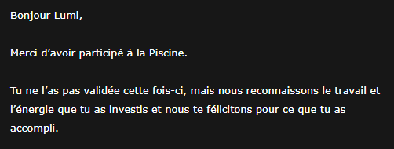
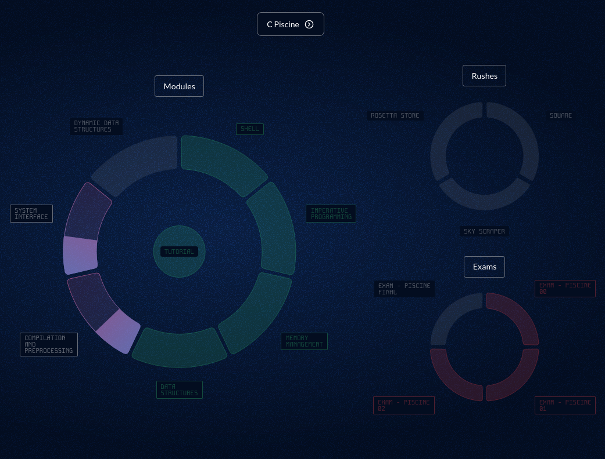

# 42 Paris - Mon Parcours de Piscineuse (Lumi)

Bienvenue sur mon dépôt regroupant mes exercices et projets réalisés à **42 Paris**. Ce repo documente ma progression, mes réussites et mes itérations.

Si ce repo vous plait (par X ou Y raisons), merci de laisser une petite étoile ^^

## 📑 Sommaire
- [Resultat 42 Paris (2 Avril 2026)](#resultat-42-paris-2-avril-2026)
- [⛔ Règle Anti-Triche](#-règle-anti-triche)
- [📊 État d'avancement - Stats](#-état-davancement---stats)
- [🏗️ Détails des exercices réalisés](#️-détails-des-exercices-réalisés)
- [📝 Mes Examens](#-mes-examens)
- [🫂 Note sur les Rushs](#-note-sur-les-rushs)
- [📁 Structure du Dépôt](#-structure-du-dépôt)
- [💖 Remerciements (Le fameux Peer-Learning)](#-remerciements-le-fameux-peer-learning)

---
## Resultat 42 Paris (2 Avril 2026)
> [!IMPORTANT]
> On a eu les resultats, j'ai été refusée... j'suis degoutée a mort... Je sais pas si je retente 2027...
>
> **Update 10 Avril 2026** :
> Toujours en periode de doute, mais je pense retry, mais j'aurait pas le droit a l'erreur.



## ⛔ **Règle Anti-Triche** 
> [!CAUTION]
> Ce dépôt est public pour montrer mon évolution. Si tu vas tenter la piscine a 42, copier ce code pour tes rendus est **strictement interdit**. C'est comptée comme de la triche, et c'est l'exclusion direct. Apprends par toi-même, c'est la seule façon de réussir les exams ! (et demande pas a ChatGPT c'est pire)
Preuve ci-dessous : 


> [!IMPORTANT]
> Le Peer-Learning est la base absolue de 42. Je vous conseille ENORMEMENT d'aider le plus de monde, de meme pour les Reviews que vous devez donner aux autres. Vous pouvez etre refuser juste pour sa. ce qui serait dommage.

---
## 📊 État d'avancement - Stats
* **Niveau Actuel :** `Level 4 [34/100 XP]`


**Mon Holy Graph** :



**Mes Stats de Venue** :


## 🏗️ Détails des exercices réalisés

Voici l'historique de mes validations. Chaque "Attempt" représente une étape de compréhension.

> [!IMPORTANT]
> Tips : Evitez de tout rendre en un seul try, vous vous ferez suspecter de triche, et si vous vous faites suspecter de triche, preparez vous a vous faire virer de 42.
> cf. [⛔ Règle Anti-Triche](#-règle-anti-triche)

### 🐚 Module : Shell & Git
**Vue d'ensemble** :


| Projet | Tentatives | Statut | Date Debut/Fin |
| :--- | :--- | :--- | :--- |
| **[Shell Fundamentals](./Shell/Shell-Fundamentals/)** | 4 Attempts | ✅ Success | 02/03/2026 16h26 - 03/03/2026 9h38 |
| **[Git Fundamentals](./Shell/Git-Fundamentals/)** | 3 Attempts | ✅ Success | 02/03/2026 17h42 - 03/03/2026 11h39 |
| **[Shell searching and finding](./Shell/Shell-Searching-And-Finding/)** | 3 Attempts | ✅ Success | 03/03/2026 14h01 - 03/03/2026 16h57 |

> Temps Total : 1 Jour, 31 Minutes.

<details>
    <summary>Tout mes Tries Reussis</summary> :

- Shell Fundamentals :

 

- Git Fundamentals :


- Shell Searching And Finding :


</details>

### 💻 Module : Imperative Programming
**Vue d'ensemble** :


| Projet | Tentatives | Statut | Date Debut/Fin |
| :--- | :--- | :--- | :--- |
| **[C Programming Fundamentals](./Imperative%20Programming/C-Programming-Fundamentals/)** | 5 Attempts | ✅ Success | 04/03/2026 10h29 - 04/03/2026 17h54 | 
| **[C Characters Arithmetics](./Imperative%20Programming/C-Characters-Arithmetics/)** | 2 Attempts | ✅ Success | 06/03/2026 9h47 - 06/03/2026 11h20 | 
| **[C Algorithmics Fundamentals](./Imperative%20Programming/C-Algorithmics-Fundamentals/)** | 4 Attempts | ✅ Success | 09/03/2026 12h06 - 09/03/2026 16h10 |

> Temps Total : 5 Jours, 5 Heures, 41 Minutes.

<details>
    <summary>Tout mes Tries Reussis</summary> :

- C Programming Fundamentals :


- C Characters Arithmetics :


- C Algorithmics Fundamentals :


</details>

### 🧠 Module : Memory Management
**Vue d'ensemble** :


| Projet | Tentatives | Statut | Date Début/Fin |
| :--- | :--- | :--- | :--- |
| **[C Pointers](./Memory%20Management/C-Pointers/)** | 1 Attempt | ✅ Success | 10/03/2026 9h29 - 10/03/2026 17h10 (plus l'heure exacte) |
| **[C Simple strings](./Memory%20Management/C-Simple-Strings/)** | 3 Attempts | ✅ Success | 10/03/2026 17h49 - 11/03/2026 11h04 |
| **[C Function Pointers](./Memory%20Management/C-Function-Pointers/)** | 4 Attempts | ✅ Success | 16/03/2026 13h24 - 19/03/2026 12h22 |
| **[C Memory Management](./Memory%20Management/C-Memory-Management/)** | 5 Attempts | ✅ Success | 19/03/2026 14h07 - 23/03/2026 20h18 |
| **[C System Interface](./Memory%20Management/C-System-Interface/)** | 2 Attempts | ✅ Success | 19/03/2026 12h24 - 25/03/2026 16h09 |

> Temps Total : 15 Jours, 6 Heures, 40 Minutes

<details>
    <summary>Tout mes Tries Reussis</summary> :

- C Pointers : 


- C Simple Strings :


- C Function Pointers :


- C Memory Management Management :


- C System Interface :


</details>

### 🏗️ Module : Data Structures
**Vue d'ensemble** :


| Projet | Tentatives | Statut | Date Début/Fin |
| :--- | :--- | :--- | :--- |
| **[C Strings](./Data%20Structures/C-Strings)** | 3 Attempts | ✅ Success | 23/03/2026 20h21 - 26/03/2026 2h04 |
| **[C Structures](./Data%20Structures/C-Structures)** | 1 Attempt | ✅ Success | 25/03/2026 16h12 - 26/03/2026 3h18 |

> Temps Total : 2 Jours, 6 Heures, 57 Minutes.
 
<details>
    <summary>Tout mes Tries Reussis</summary> :

- C-Strings :


- C-Structures :


</details>

### 🖥️ Module : Compilation and Preprocessing
**Vue d'ensemble** :


| Projet | Tentatives | Statut | Date Début/Fin |
| :--- | :--- | :--- | :--- |
| **C Preprocessor** | Non Realisé | ❌ Echec | ??? |
| **C Libft** | Non Realisé | ❌ Echec | ??? |

### 👩🏻‍💻 Module : System Interface
**Vue d'ensemble** :


| Projet | Tentatives | Statut | Date Début/Fin |
| :--- | :--- | :--- | :--- |
| **C File Operations** | Non Realisé | ❌ Echec | ??? |

### 🤷‍♀️ Module : Dynamic Data Structures
**Vue d'ensemble** :


| Projet | Tentatives | Statut | Date Début/Fin |
| :--- | :--- | :--- | :--- |
| **C Linked Lists** | Non Realisé | ❌ Echec | ??? |
| **C Binary Trees** | Non Realisé | ❌ Echec | ??? |

## 📝 Mes Examens
| Examen | Score | Résultat | Raison | Heure de sortie de la salle d'exam |
| :--- | :--- | :--- | :--- | :--- |
| **Exam 00 (06/03/2026)** | 40/100 | ❌ Echouée | (Abandon sur putnbr) | 18h00 |
| **Exam 01 (13/03/2026)** | 0/100 | ❌ Echouée | (Exclue d'exam injustement) | 15h50 (Exam meme pas commencer) |
| **Exam 02 (20/03/2026)** | 10/100 | ❌ Echouée | (Problemes de santé) | 17h00 |
| **Exam 03 (27/03/2026)** | 31/100 | ❌ Échouée | (Abandon sur atoi, tout a été oublié) | 16h30 |

> [!NOTE]
> Update 30/03/2026 : Me rappellant de comment s'est fini le dernier Exam, je me suis souvenue d'avoir fait crash (Error 500 Internal Server Error) Moulinette (celui de l'Examshell, pas le Normal). Et en faisant une connerie, j'ai juste pu get des infos un peu chelou sur Moulinette (Comme quoi Moulinette est en realiter du Python derriere. pour sa que le CC a changer ?)

> [!NOTE]
> Quand je montre mon repo a des gens, personne ne comprends pourquoi j'me suis fait exclure a l'Exam01, je vais mettre la raison juste ici : Quelqu'un m'as parlée, j'ai pas réagit, mais le tuteur qui nous surveillait a cru que j'avais parlée, par conséquent, je me suis fait virer. Mais j'ajoute une petite précision : La personne qui m'as fait m'exclure d'exam a fais son maximum pour me défendre, mais le tuteur en question n'as rien voulu savoir...

- Mes Exams :


---

## 🫂 Note sur les Rushs

Durant mon cursus, je n'ai participée à **aucun Rush** (Je vous déconseille très fortement de faire comme moi). 

C'est un choix réfléchi liée à ma situation personnelle : Souffrant de Dépression sévere depuis longtemps, souffrant aussi d'insomnie assez costaud, souffrant aussi de dysphorie de genre (Reconnue comme homme actuellement meme si je me reconnais comme femme), tout en ayant des soucis d'attention et de concentration, et pire en étant solitaire, a cause d'un harcelement violent subie a l'époque, cela me donne les raisons de pourquoi j'ai préférée ne pas en faire. Oui c'est une erreur, je l'accorde. mais quand en pleine exam on oublie comment faire putnbr (Exam 02 echoué a cause de sa), que notre corps fait n'importe quoi, ou meme se retiens de faire un malaise (a failli arriver 10min avant qu'on decampe des Clusters a 15h). c'est pas trop trop la forme...

Au jour ou j'ecrit ces lignes (23/03/2026), j'espere que cela ne va pas m'impacter sur mon entrée a 42 Paris 

Update 4/2/2026 : L'update a été drop plus haut.

---

## 📁 Structure du Dépôt
Le code est organisé par module, tel que vu dans mon architecture locale :
```Shell
├── 42-Docs # Liste de toutes les Documentations de cette Piscine. | Tous dans l'ordre de la piscine
│   ├── Tutorial
│   ├── Shell
│   ├── Imperative Programming
│   ├── Memory Management
│   ├── Data Structures
│   ├── Compilation and Preprocessing
│   ├── System Interface
│   ├── Dynamic Data Structures
│   ├── Norminette # Documentation de comment fonctionne la Norme
│   └── Rushs # Les rushs present a 42
├── Data Structures # Gestion de Structure 
│   ├── C-Strings
│   └── C-Structures
├── Imperative Programming # Les bases du C et de l'algo.
│   ├── C-Algorithmics-Fundamentals
│   ├── C-Characters-Arithmetics
│   └── C-Programming-Fundamentals
├── Memory Management # Manipulation de pointeurs, `strdup`, `malloc` et gestion mémoire.
│   ├── C-Function-Pointers
│   ├── C-Memory-Management
│   ├── C-Pointers  
│   ├── C-Simple-Strings
│   └── C-System-Interface
├── Shell # Scripts et fondamentaux du terminal.
│   ├── Git-Fundamentals
│   ├── Shell-Fundamentals
│   └── Shell-Searching-And-Finding
└── Tutorial # Le tutoriel, aussi simple
    └── C-Project-Tutorial
```

## 💖 Remerciements (Le fameux Peer-Learning)

Alors oui je sais, c'est un peu inutile. Mais je vous montre qui m'as aider durant ma Piscine a 42. Et meme pour l'ambiance pour que sa donnais :
- lcoant-- (Lohann) : C'est le tryhardeur de 42. Vraiment. Il a tracer tt le monde, et nous aide comme jamais.
- lmauriti (Loïc) : Ce mec a vraiment une bonne vibe, on rigole, on s'aide. Un bon type celui la.
- julhuang (Julien) : Une personne bonne vibe, s'amuse un peu a faire le trolleur, mais ce type c'est un bon gars.
- pguermon (Paul) : Le mec fou du groupe. Il a réussi a faire crash Malloc (UN EXPLOIT BORDEL). 
- Et plein d'autres (mon fichier va faire 50 lignes juste pour sa, ce que j'évite un peu)

---
*Fait avec ❤️  par Lumi (42 Paris)*
