# 42 Paris - Mon Parcours de Piscineuse (Lumi)

Bienvenue sur mon dépôt regroupant mes exercices et projets réalisés à **42 Paris**. Ce repo documente ma progression, mes réussites et mes itérations.

---

> [!NOTE]
> Quelques jours apres ma piscine, je risque de faire un article sur mon [site](https://syxpi.fr), Je vous conseille de regarder regulierement 👀
## 📊 Mon État d'Avancement
* **Niveau Actuel :** `Level 4 [34/100 XP]`

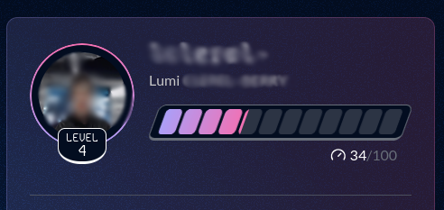

> [!CAUTION]
> **RÈGLE ANTI-TRICHE** : Ce dépôt est public pour montrer mon évolution. Si tu vas tenter la piscine a 42, copier ce code pour tes rendus est **strictement interdit**. C'est comptée comme de la triche, et c'est l'exclusion direct. Apprends par toi-même, c'est la seule façon de réussir les exams ! (et demande pas a ChatGPT c'est pire)
Preuve ci-dessous : 


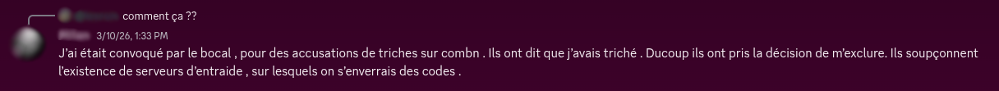

> [!IMPORTANT]
> Le Peer-Learning est la base absolue de 42. Je vous conseille ENORMEMENT d'aider le plus de monde, de meme pour les Reviews que vous devez donner aux autres. Vous pouvez etre refuser juste pour sa. ce qui serait dommage.

---
## 📊 Vue de mon Holy Graph et Stats
**Mon Holy Graph** : 


**Mes Stats de Venue**

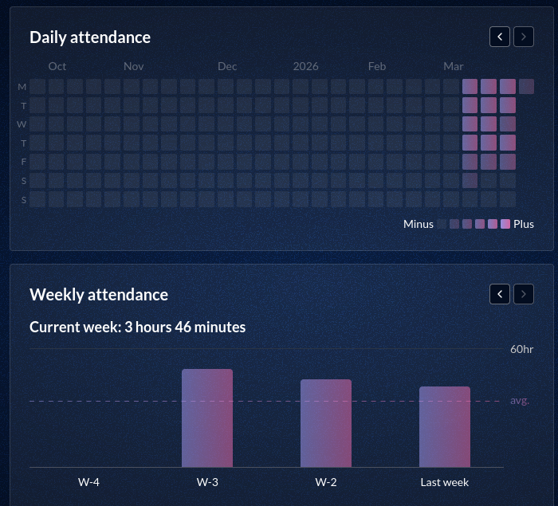

## 🏗️ Détails des Paliers & Tentatives (Tries)

Voici l'historique de mes validations. Chaque "Attempt" représente une étape de compréhension.

### 🐚 Module : Shell & Git
**Vue d'ensemble** :

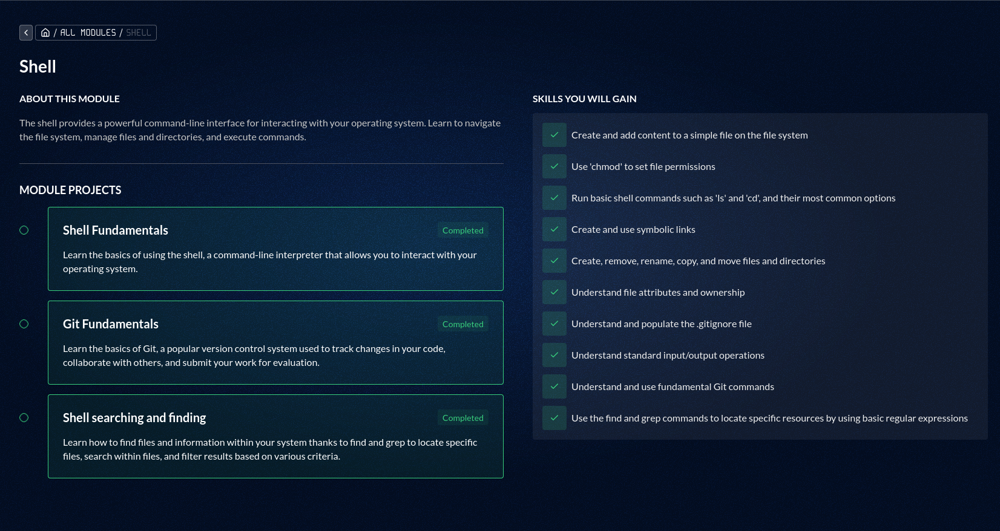

| Projet | Tentatives | Statut | Date Debut/Fin |
| :--- | :--- | :--- | :--- |
| **[Shell Fundamentals](./Shell/Shell-Fundamentals/)** | 4 Attempts | ✅ Success | 02/03/2026 16h26 - 03/03/2026 9h38 |
| **[Git Fundamentals](./Shell/Git-Fundamentals/)** | 3 Attempts | ✅ Success | 02/03/2026 17h42 - 03/03/2026 11h39 |
| **[Shell searching and finding](./Shell/Shell-Searching-And-Finding/)** | 3 Attempts | ✅ Success | 03/03/2026 14h01 - 03/03/2026 16h57 |

**Tout mes Tries Reussis** :

- Shell Fundamentals :

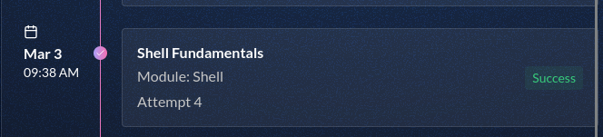

- Git Fundamentals :

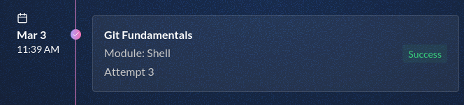

- Shell Searching And Finding :

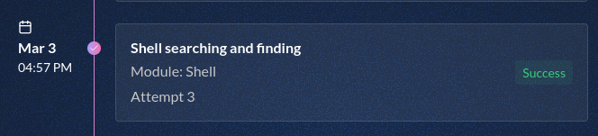

### 💻 Module : Imperative Programming
**Vue d'ensemble** :

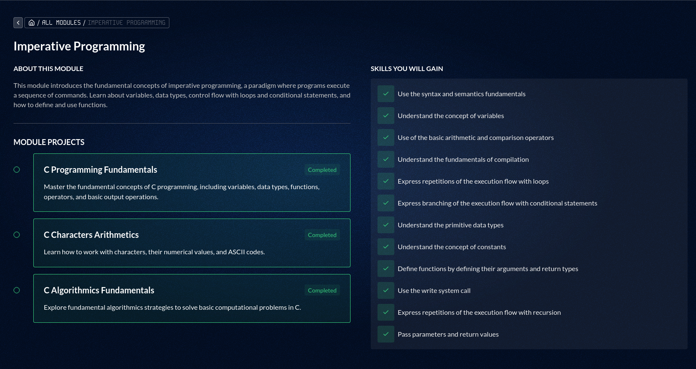

| Projet | Tentatives | Statut | Date Debut/Fin |
| :--- | :--- | :--- | :--- |
| **[C Programming Fundamentals](./Imperative%20Programming/C-Programming-Fundamentals/)** | 5 Attempts | ✅ Success | 04/03/2026 10h29 - 04/03/2026 17h54 | 
| **[C Characters Arithmetics](./Imperative%20Programming/C-Characters-Arithmetics/)** | 2 Attempts | ✅ Success | 06/03/2026 9h47 - 06/03/2026 11h20 | 
| **[C Algorithmics Fundamentals](./Imperative%20Programming/C-Algorithmics-Fundamentals/)** | 4 Attempts | ✅ Success | 09/03/2026 12h06 - 09/03/2026 16h10 |

**Tout mes Tries Reussis** :

- C Programming Fundamentals :

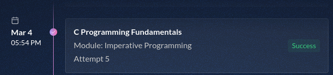

- C Characters Arithmetics :


- C Algorithmics Fundamentals :

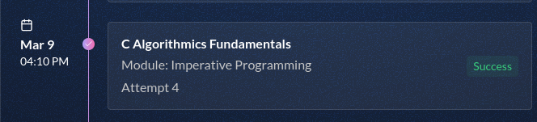

### 🧠 Module : Memory Management
**Vue d'ensemble** :

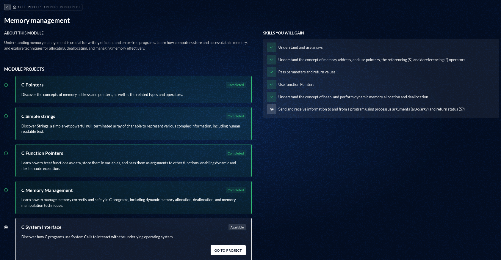

| Projet | Tentatives | Statut | Date Début/Fin |
| :--- | :--- | :--- | :--- |
| **[C Pointers](./Memory%20Management/C-Pointers/)** | 1 Attempt | ✅ Success | 10/03/2026 9h29 (la fin a été genre quelques heures après) |
| **[C Simple strings](./Memory%20Management/C-Simple-Strings/)** | 3 Attempts | ✅ Success | 10/03/2026 17h49 - 11/03/2026 11h04 |
| **[C Function Pointers](./Memory%20Management/C-Function-Pointers/)** | 4 Attempts | ✅ Success | 16/03/2026 13h24 - 19/03/2026 12h22 |
| **[C Memory Management](./Memory%20Management/C-Memory-Management/)** | 5 Attempts | ✅ Success | 19/03/2026 14h07 - 23/03/2026 20h18 |
| **[C System Interface](./Memory%20Management/C-System-Interface/)** | 2 Attempts | ✅ Success | 19/03/2026 12h24 - 25/03/2026 16h09 |

**Tout mes Tries Reussis** :

- C Pointers : 

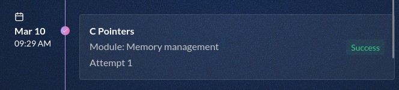

- C Simple Strings :

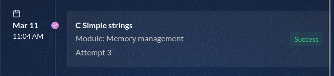

- C Function Pointers :

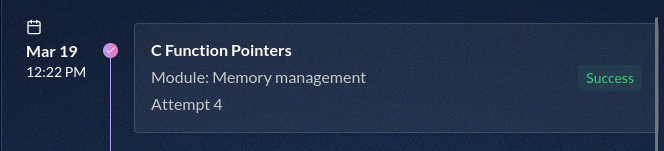

- C Memory Management Management :

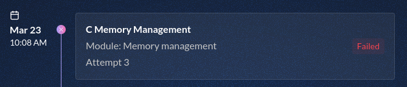

- C System Interface :

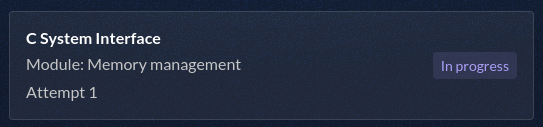

### 🏗️ Module : Data Structures
**Vue d'ensemble** :

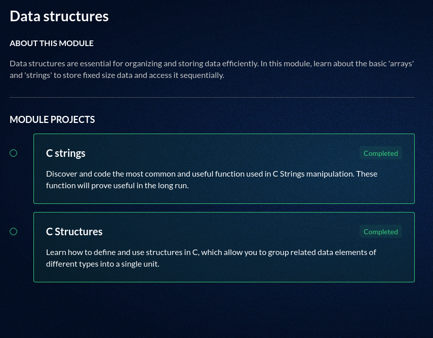

| Projet | Tentatives | Statut | Date Début/Fin |
| :--- | :--- | :--- | :--- |
| **[C Strings](./Data%20Structures/C-Strings)** | 3 Attempts | ✅ Success | 23/03/2026 20h21 - 26/03/2026 2h04 |
| **[C Structures](./Data%20Structures/C-Structures)** | 1 Attempt | ✅ Success | 25/03/2026 16h12 - 26/03/2026 3h18 |

**Tout mes Tries Reussis** :

- C-Strings :

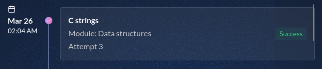

- C-Structures :


### 🖥️ Module : Compilation and Preprocessing
**Vue d'ensemble** :

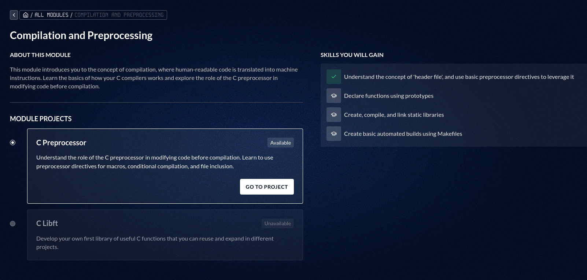

| Projet | Tentatives | Statut | Date Début/Fin |
| :--- | :--- | :--- | :--- |
| **C Preprocessor** | Non Realisé | ❌ Echec | ??? |
| **C Libft** | Non Realisé | ❌ Echec | ??? |

### 👩🏻‍💻 Module : System Interface
**Vue d'ensemble** :

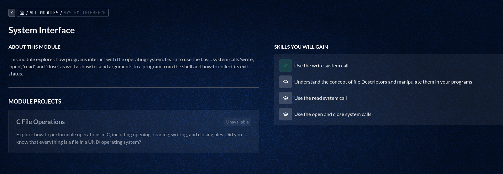

| Projet | Tentatives | Statut | Date Début/Fin |
| :--- | :--- | :--- | :--- |
| **C File Operations** | Non Realisé | ❌ Echec | ??? |

### 🤷‍♀️ Module : Dynamic Data Structures
**Vue d'ensemble** :

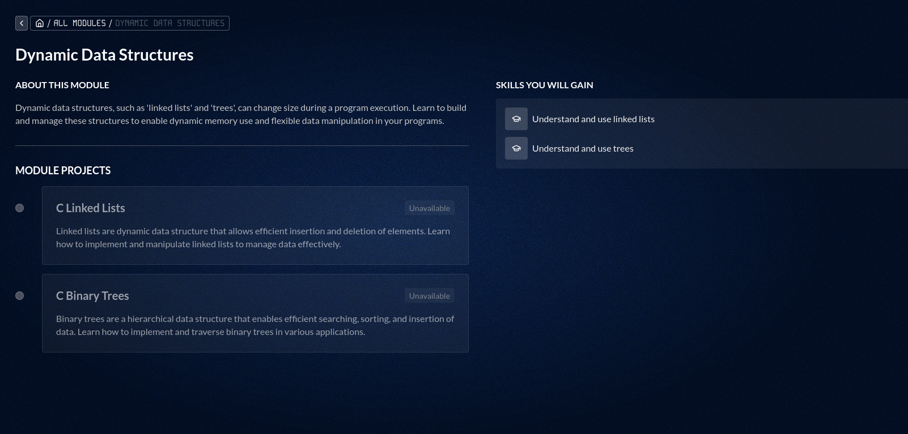

| Projet | Tentatives | Statut | Date Début/Fin |
| :--- | :--- | :--- | :--- |
| **C Linked Lists** | Non Realisé | ❌ Echec | ??? |
| **C Binary Trees** | Non Realisé | ❌ Echec | ??? |

## 📝 Mes Examens
| Examen | Score | Résultat | Raison | 
| :--- | :--- | :--- | :--- | 
| **Exam 00 (06/03/2026)** | 40/100 | ❌ Echouée | (Abandon sur putnbr) |
| **Exam 01 (13/03/2026)** | 0/100 | ❌ Echouée | (Exclue d'exam injustement) |
| **Exam 02 (20/03/2026)** | 10/100 | ❌ Echouée | (Problemes de santé) |
| **Exam 03 (27/03/2026)** | ??/??? | A Venir | ??? |

- Mes Exams :

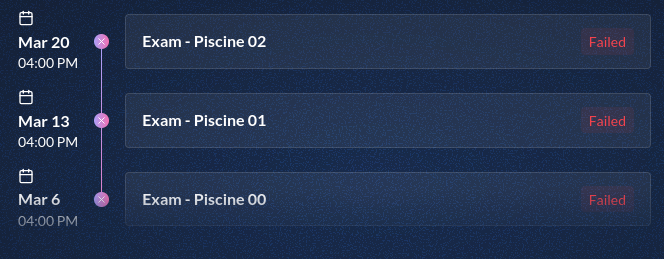

---

## 🫂 Note sur les Rushs

Durant mon cursus, je n'ai participée à **aucun Rush** (Je vous déconseille très fortement de faire comme moi). 

C'est un choix réfléchi liée à ma situation personnelle : Souffrant de Dépression Sévere depuis longtemps, souffrant aussi d'insomnie assez costaud, souffrant aussi de dysphorie de genre (Reconnue comme homme actuellement meme si je me reconnais comme femme), tout en ayant des soucis d'attention et de concentration, et pire en étant solitaire, a cause d'un harcelement violent subie a l'époque, cela me donne les raisons de pourquoi j'ai préférée ne pas en faire. Oui c'est une erreur, je l'accorde. mais quand en pleine exam on oublie comment faire putnbr (Exam 02 echoué a cause de sa), que notre corps fait n'importe quoi, ou meme se retiens de faire un malaise (a failli arriver 10min avant qu'on decampe des Clusters a 15h). c'est pas trop trop la forme...

Au jour ou j'ecrit ces lignes (23/03/2026), j'espere que cela ne va pas m'impacter sur mon entrée a 42 Paris 

---

## 📁 Structure du Dépôt
Le code est organisé par module, tel que vu dans mon architecture locale :
```Shell
├── 42-Docs # Liste de toutes les Documentations de cette Piscine.
│   ├── Data Structures
│   ├── Imperative Programming
│   ├── Memory Management
│   ├── System Interface
│   ├── Compilation and Preprocessing
│   ├── Norminette # Documentation de comment fonctionne la Norme
│   ├── Shell
│   └── Tutorial
├── Data Structures # Gestion de Structure 
│   ├── C-Strings
│   └── C-Structures # Pas encore fait
├── Imperative Programming # Les bases du C et de l'algo.
│   ├── C-Algorithmics-Fundamentals
│   ├── C-Characters-Arithmetics
│   └── C-Programming-Fundamentals
├── Memory Management # Manipulation de pointeurs, `strdup`, `malloc` et gestion mémoire.
│   ├── C-Function-Pointers
│   ├── C-Memory-Management
│   ├── C-Pointers  
│   ├── C-Simple-Strings
│   └── C-System-Interface
├── Shell # Scripts et fondamentaux du terminal.
│   ├── Git-Fundamentals
│   ├── Shell-Fundamentals
│   └── Shell-Searching-And-Finding
└── Tutorial # Le tutoriel, aussi simple
    └── C-Project-Tutorial
```

## 💖 Remerciements (Le fameux Peer-Learning)

Alors oui je sais, c'est un peu inutile. Mais je vous montre qui m'as aider durant ma Piscine a 42. Et meme pour l'ambiance pour que sa donnais :
- lcoant-- (Lohann) : C'est le tryhardeur de 42. Vraiment. Il a tracer tt le monde, et nous aide comme jamais.
- lmauriti (Loïc) : Ce mec a vraiment une bonne vibe, on rigole, on s'aide. Un bon type celui la.
- julhuang (Julien) : Une personne bonne vibe, s'amuse un peu a faire le trolleur, mais ce type c'est un bon gars.
- pguermon (Paul) : Le mec fou du groupe. Il a réussi a faire crash Malloc (UN EXPLOIT BORDEL). 
- Et plein d'autres (mon fichier va faire 50 lignes juste pour sa, ce que j'évite un peu)

---
*Fait avec ❤️  par Lumi (42 Paris)*
